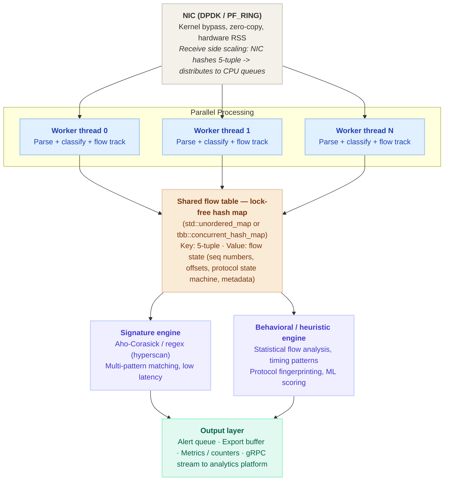

## OSI Layers

---

| Layer | Name (Unit) | Key Protocols / Technologies | DPI Relevance |
| :--- | :--- | :--- | :--- |
| **7** | **Application** (Data) | HTTP/2, QUIC, DNS, TLS, SMTP, MQTT, RTP | Protocol fingerprinting, content inspection target |
| **6** | **Presentation** (Data) | TLS/SSL encryption, encoding, compression | TLS decryption & SSL inspection techniques |
| **5** | **Session** (Data) | NetBIOS, RPC, SOCKS, session establishment | Session tracking, flow reassembly |
| **4** | **Transport** (Segments) | TCP, UDP, SCTP, QUIC, ports, flow control | Port-based classification, TCP stream reassembly |
| **3** | **Network** (Packets) | IPv4, IPv6, ICMP, routing, fragmentation | IP header parsing, defragmentation |
| **2** | **Data Link** (Frames) | Ethernet, Wi-Fi (802.11), MAC, VLANs, ARP | Frame capture entry point, MAC filtering |
| **1** | **Physical** (Bits) | Electrical signals, fiber, radio, NICs, cables | NIC tap, port mirroring, SPAN/TAP hardware |

For each layer:
* PDU name (bits / frames / packets / segments / data)
* Key header fields
* how you'd access them in C++ (raw byte offsets, struct casting, `ntohl`/`ntohs` for byte-order conversion).

## Deep Packet Inspection (DPI) pipeline

---

### Deep Packet Inspection Pipeline Breakdown

| Stage | Capture | L2–L3 Decode | L4 Decode | L7 Classify | Action |
| :--- | :--- | :--- | :--- | :--- | :--- |
| **High-Level Function** | NIC TAP / SPAN | Ethernet, IP, defragmentation | TCP/UDP ports, stream reassembly | Protocol ID, signature matching | Log / block / forward |
| **Technical Details** | • Port mirroring • Inline tap (bump-in-the-wire) • libpcap / PF_RING / DPDK • Zero-copy ring buffers | • Ethernet frame parsing • IP header fields • TTL, checksum, flags • IPv4 fragmentation | • TCP 3-way handshake • Sequence reassembly • Stateful flow tracking • 5-tuple: src/dst IP+ports | • Pattern / regex matching • Behavioral fingerprinting • Protocol heuristics • Statistical analysis | • Block / allow • Rate limit • Alert & log • Mirror / export |

---

### Core Data Structure: Flow Table
**5-tuple state machine:** `src IP` · `dst IP` · `src port` · `dst port` · `protocol`

> Packets are correlated into flows using a hash map keyed on the 5-tuple — the core data structure in any DPI engine.

---

### Key Topics

* The **5-tuple** is the atomic unit of DPI — source IP, destination IP, source port, destination port, and protocol.

* **TCP stream reassembly** Packets arrive out of order. TCP sequence numbers are how you put them back together. Know what `SEQ`, `ACK`, `SYN`, `FIN`, `RST` flags mean and how a state machine tracks a TCP connection through its lifecycle.

**Protocol fingerprinting** The two main approaches are: signature-based (pattern matching at byte offsets — e.g., HTTP always starts with a known verb) and behavioral/statistical (flow timing, packet size distributions, inter-arrival times).

**Aho-Corasick** is the algorithm behind multi-pattern string matching in DPI engines. Know what it does and why it's preferred over naive regex for matching thousands of patterns simultaneously. Intel's Hyperscan is the production library — worth knowing the name. [Aho–Corasick algorithm](https://en.wikipedia.org/wiki/Aho%E2%80%93Corasick_algorithm)

**Byte order** — network byte order is big-endian; x86 hosts are little-endian. Call `ntohs()` / `ntohl()` when reading IP and TCP header fields.

---

### C++ Implementation Notes
* **Headers/Casting:** Use `struct iphdr` / `tcphdr` + `reinterpret_cast`.
* **Byte Order:** Utilize `ntohs()` / `ntohl()` for network-to-host conversions.
* **Storage:** `std::unordered_map` is typically used for the flow table.
* **Memory Management:** Use **RAII** (Resource Acquisition Is Initialization) for managing packet buffers to prevent leaks.

---

### System Design: High-Throughput DPI Pipeline

Key design decisions:
* No locks on the hot path
* Cache-aligned structs
* Pre-allocated packet pools
* NUMA-aware memory
* Lock-free SPSC queues between stages

---

## Reverse Engineering an Unknown Protocol — The Method

Since the job posting explicitly mentions this, have a structured answer ready:

1. **Capture traffic** with Wireshark or tcpdump and look for fixed-size headers, magic bytes, or repeated patterns at known offsets.
2. **Identify structure** — find length fields, message type fields, and checksums by observing correlations between values and payload sizes.
3. **Generate input variants** — if you control one endpoint, send controlled inputs and observe how the wire encoding changes.
4. **Look for entropy** — low-entropy fields are likely fixed strings or enumerations; high-entropy fields are likely encrypted or compressed payloads.
5. **Document incrementally** as a C struct and validate by writing a parser and replaying captured traffic through it.

---

## Quick-Reference Cheat Sheet

| Topic | What to know |
|---|---|
| **5-tuple** | src IP, dst IP, src port, dst port, protocol |
| **TCP flags** | SYN, ACK, FIN, RST, PSH, URG — and the state machine |
| **IP fragmentation** | MF flag, fragment offset, reassembly at L3 |
| **Byte order** | Network = big-endian; always use `ntohl`/`ntohs` |
| **Pattern matching** | Aho-Corasick for multi-pattern, Hyperscan for production |
| **Flow table** | Hash map keyed on 5-tuple, RAII-managed entries |
| **TLS inspection** | Requires key material or MITM proxy; blind to encrypted payload otherwise |
| **QUIC** | UDP-based, encrypts transport headers — harder to inspect than TCP |
| **DPDK / PF_RING** | Kernel-bypass capture for line-rate packet processing |
| **Tools** | Wireshark, tcpdump, Scapy (Python), nmap, tshark |

